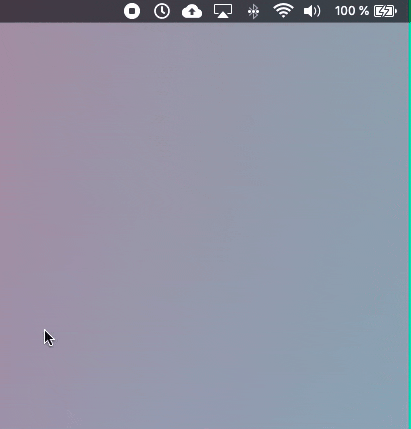

# Timer App for Mac OS

Timer **User-Agent App** written in Swift for Mac OS.

Using Gesture Recognizer to set the time, User Notification on finished Timer.

---

## Ressources & Inspirations:

- [User Notification Image](https://github.com/lukakerr/Swift-NSUserNotificationPrivate)
- [Gestimer](http://maddin.io/gestimer/)
